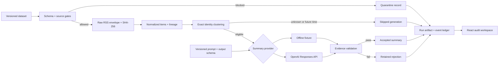
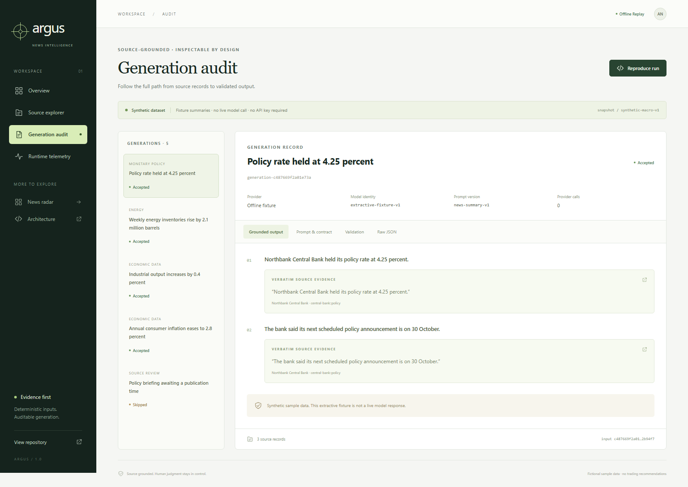

# Argus

**Source-grounded LLM news intelligence system with deterministic ingestion, auditable generation, and reproducible runtime telemetry.**

[](https://github.com/alinoori7723/argus-llm-news-intelligence/actions/workflows/quality.yml)
[](LICENSE)

[Explore the demo](https://alinoori7723.github.io/argus-llm-news-intelligence/) · [Architecture](docs/ARCHITECTURE.md) · [Evaluation](docs/EVALUATION.md) · [Reproduce a run](docs/REPRODUCIBILITY.md)

Argus turns a bounded set of news records into summaries that can be traced back to exact source passages. Ingestion and clustering are deterministic. Generation sits behind a provider interface; every accepted claim must pass schema, citation, evidence-span, and numeric-support checks. Rejected outputs remain in the audit record.

The browser demo uses **12 fictional records and an extractive fixture provider**. It makes no model calls and needs no credentials. The CLI also implements live OpenAI generation through the Responses API. Provider contract tests use controlled HTTP responses; the committed demo is not evidence of live model quality.


## A two-minute walkthrough

1. Open the [workspace](https://alinoori7723.github.io/argus-llm-news-intelligence/). Four accepted summaries come from a reproducible pipeline run.
2. Select a numbered citation. Inspect the original passage, source and observation timestamps, raw RSS envelope, and SHA-256 identities.
3. Open **Generation audit**. Switch between output, versioned prompt, validation results, and the complete generation record.
4. Open **Runtime telemetry**. Inspect measured local stage durations and the semantic hash. Absent model usage is explicitly marked as such.

## Run locally

Requires Node.js 24 and pnpm 11.19.0.

```bash
git clone https://github.com/alinoori7723/argus-llm-news-intelligence.git
cd argus-llm-news-intelligence
corepack enable
corepack prepare pnpm@11.19.0 --activate
pnpm install --frozen-lockfile
pnpm dev
```

Open the local URL printed by Vite. The default workspace is fully offline.

```bash
pnpm pipeline:replay
pnpm demo:verify
pnpm eval
```

The sample produces **10 ingested records, 2 quarantined records, 5 exact-identity clusters, 4 accepted summaries, and 1 skipped generation**. Each run creates a new directory under `.argus/runs/` with `run.json`, a hash-linked `events.jsonl`, and `manifest.json`. The CLI prints the exact directory.

```bash
pnpm pipeline:verify --verify .argus/runs/<run-id>
```

## Live LLM generation

Copy `.env.example` to `.env.local` and set `OPENAI_API_KEY` locally. Then run:

```bash
pnpm pipeline:live
pnpm pipeline:live --input path/to/dataset.json
```

Live requests use a pinned `gpt-4.1-mini-2025-04-14` snapshot, a versioned prompt, strict structured output, and a default estimated request budget of $0.10. The key stays in the Node process. Live artifacts remain local and do not replace the public demo. No fixture fallback occurs on provider failure. See [operations](docs/OPERATIONS.md) for retry, timeout, pricing, and failure behavior.

## What is implemented

| Capability                   | Implementation                                                                                                               | Inspect                                                                                 |
| ---------------------------- | ---------------------------------------------------------------------------------------------------------------------------- | --------------------------------------------------------------------------------------- |
| Deterministic ingestion      | Strict dataset validation, stable ordering, source permission gates, injected observation clock, versioned RSS normalization | [ingest.ts](pipeline/ingest.ts)                                                         |
| Deduplication and clustering | Canonical URL and exact content identity; stable connected components with recorded match reasons                            | [domain rules](src/domain/clustering/dedupe.ts), [pipeline adapter](pipeline/ingest.ts) |
| LLM summarization            | OpenAI Responses adapter, bounded retries, refusal handling, strict JSON Schema                                              | [provider](pipeline/providers/openai.ts)                                                |
| Source lineage               | Claim → exact quote → normalized item → raw payload SHA-256                                                                  | [contracts](pipeline/contracts.ts), [validator](pipeline/validate.ts)                   |
| Prompt and model tracking    | Prompt text/version/hash, schema hash, requested and returned model identity, provider response ID                           | [prompt](pipeline/prompt.ts), [generation orchestration](pipeline/run.ts)               |
| Runtime telemetry            | Measured stage and attempt latency, provider-reported tokens, cached-token accounting, dated cost estimates                  | [run.ts](pipeline/run.ts), [pricing.ts](pipeline/pricing.ts)                            |
| Local audit persistence      | Exclusive per-run files, hash-linked event ledger, manifest verification, retained rejections                                | [storage.ts](pipeline/storage.ts)                                                       |
| Evaluation and tests         | Domain regressions, provider failure tests, evidence validation cases, artifact tamper tests, Chromium user journeys         | [evaluation](docs/EVALUATION.md)                                                        |

## Architecture



The browser consumes a committed synthetic run. It never imports the live provider or holds API credentials. Deterministic domain logic also powers the [news radar](https://alinoori7723.github.io/argus-llm-news-intelligence/#/radar), including source gating, calendar revisions, clustering, and attention controls. [Read the design decisions and boundaries](docs/ARCHITECTURE.md).

## Inspect a generation



[Source explorer](docs/screenshots/lineage.png) · [Runtime telemetry](docs/screenshots/runtime.png) · [Mobile workspace](docs/screenshots/mobile.png)

## Verification

```bash
pnpm check
pnpm test:coverage
pnpm exec playwright install chromium
pnpm test:e2e
pnpm audit
```

CI checks types, lint, tests, fixture reproducibility, evaluation, dependency advisories, the production build, and browser journeys before deploying the static demo. The browser suite also produces the screenshots above. Coverage is scoped to the new pipeline modules; it does not represent whole-application coverage. See the [evaluation protocol](docs/EVALUATION.md) for the test boundaries.

## Deliberate boundaries

- Evidence validation checks citation membership, verbatim spans, and number support. A matching quote **does not establish semantic entailment or factual truth**. Human review remains necessary.
- Clustering resolves exact identities. It does not group merely similar stories or infer independent corroboration from syndicated sources.
- Replaying fixture input reproduces the semantic hash. Wall-clock timings vary; live LLM output can vary even with a pinned model and temperature 0.
- The ledger detects changes relative to its manifest. It is not signed or externally anchored, and cannot authenticate a directory rewritten by an attacker.
- This is a local pipeline and static inspection UI. A production service would need durable transactional storage, authentication, source licensing review, monitoring, and a labeled live-model evaluation.

## Repository guide

```text
pipeline/         Ingestion adapter, providers, validation, telemetry, local audit files
prompts/          Versioned summarization instructions
samples/          Small fictional dataset and provenance
src/domain/       Deterministic news, calendar, persistence, and attention rules
src/pages/        Intelligence workspace and news radar views
src/fixtures/     Committed synthetic run and recorded parser regression fixtures
e2e/              Browser user journeys and screenshot capture
docs/             Architecture, reproducibility, evaluation, operations, screenshots
```

Code is [MIT licensed](LICENSE). The fictional showcase dataset is [CC0-1.0](samples/README.md). Recorded third-party parser fixtures retain their original source attribution in [THIRD_PARTY_NOTICES.md](THIRD_PARTY_NOTICES.md).
