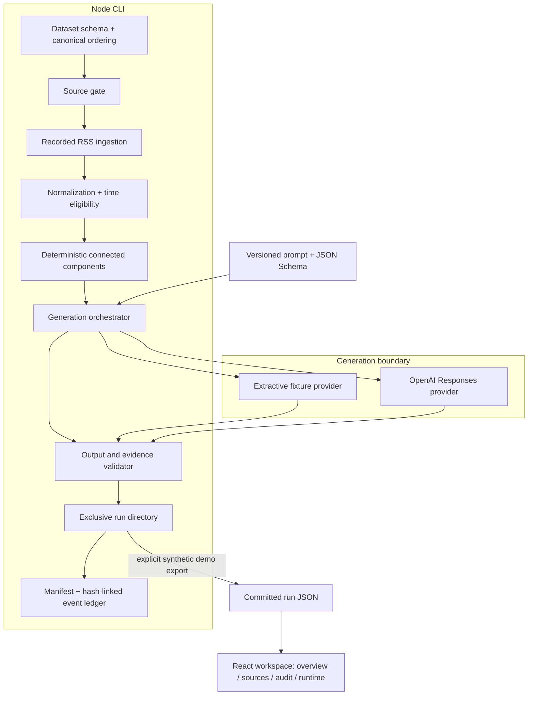

# Architecture

Argus separates deterministic evidence processing from probabilistic generation. The system accepts a bounded JSON dataset, reuses the domain RSS ingestion path, resolves exact duplicates, generates one summary per eligible cluster, and writes a locally verifiable run artifact. A React workspace makes every step inspectable.

## Boundaries

Only the live provider can call the model API. The standard dataset ingestion path makes no network requests. Recording utilities under `scripts/record-fed-rss*.ts` are separate, manually invoked provenance tools; the browser does not import them.

## Data model

| Record          | Identity and retained evidence                                                                                                                    |
| --------------- | ------------------------------------------------------------------------------------------------------------------------------------------------- |
| Dataset         | Validated schema, canonical source/article order, observation timestamp, SHA-256                                                                  |
| Raw payload     | Source ID, generated RSS text, payload ID, SHA-256                                                                                                |
| Normalized item | Source item ID, original URL, canonical URL, publication and observation timestamps, parser and normalizer versions, raw payload link             |
| Cluster         | Sorted members, stable ID, source IDs, eligibility, versioned match decisions                                                                     |
| Generation      | Input hash, prompt text/version/hash, schema hash, model identities, source IDs, raw and accepted output, validation issues, provider response ID |
| Attempt         | Sequence, status, HTTP status, request ID, measured latency, reported usage or null                                                               |
| Run             | Semantic hash, mode, dataset kind, version map, stage timings, generation outcomes, estimated cost or null                                        |

The `dataset-to-rss` adapter creates the raw RSS envelope from the supplied dataset. That envelope is replay evidence, not a claim of having downloaded the original publisher response. Separate recorded regression fixtures retain their own capture provenance.

## Design decisions

### Determinism before generation

The observation clock comes from the dataset. Sorting uses explicit lexical comparisons, not locale-sensitive ordering. Unknown publication times remain unknown. Source permissions are checked before raw payload storage. The local snapshot still retains the supplied dataset, including quarantined input, so source gating is a processing boundary rather than a data-erasure mechanism.

Exact canonical URLs and content identities produce edges. A union-find pass derives stable connected components, including transitive matches. Similar headlines alone do not merge. The bounded sample path uses an O(n²) pair comparison over at most 128 records; larger inputs would need indexed candidate retrieval and separate evaluation.

### One contract, two providers

Both providers implement `SummaryProvider` and pass through the same validator and persistence path. The fixture provider extracts source sentences. The live provider submits records as untrusted data with a strict schema, no tools, a pinned model snapshot, and `store: false`.

Provider errors become rejected generation records. Refusals, truncation, missing usage, and invalid JSON remain observable. Retry handling records every request. A provider failure never silently becomes an offline success.

### Validation is a gate

The validator requires an allowed output shape, source IDs present in that generation, exact quoted substrings, numeric support in the corresponding evidence, and exclusion of a small set of recommendation phrases. Rejected raw output stays in the record, while accepted output is null on failure.

These mechanical checks are useful but incomplete. They do not detect every unsupported paraphrase, negation error, unit mismatch, prompt injection, or recommendation. The phrase check is not a comprehensive content policy. Human review and a labeled semantic evaluation are separate requirements.

### Local persistence and replay

Each execution creates an exclusive run directory. Event records cover raw payloads, normalized items, quarantine, deduplication, clusters, and generations. The manifest hashes the exact artifact and ledger bytes. Verification reconstructs the expected ledger from the run and checks its chain and manifest.

This is file-based local audit storage. The existing browser domain uses persistence-backed consumers over an in-memory append-only store; it is not a deployed database. Reference in-memory consumer stores remain available for isolated regression tests and are guarded against active browser wiring.

### A read-only inspection surface

The intelligence workspace renders a committed run artifact. Citation inspection, source filtering, and audit tabs do not trigger generation or mutate evidence. Hash routes keep deep links working on static hosting. The existing radar workspace keeps deterministic priority, source, calendar, and attention behavior separate from generated summaries. LLM output cannot change priority or issue trades.

## Extending the system

Add a provider behind `SummaryProvider`, add its price mapping and contract tests, then evaluate it against the same evidence fixtures. Changes to prompts, schema, normalization, or clustering require a version review and a regenerated synthetic demo. For a service deployment, replace local files with transactional durable storage before adding workers, scheduling, or concurrent ingestion.
